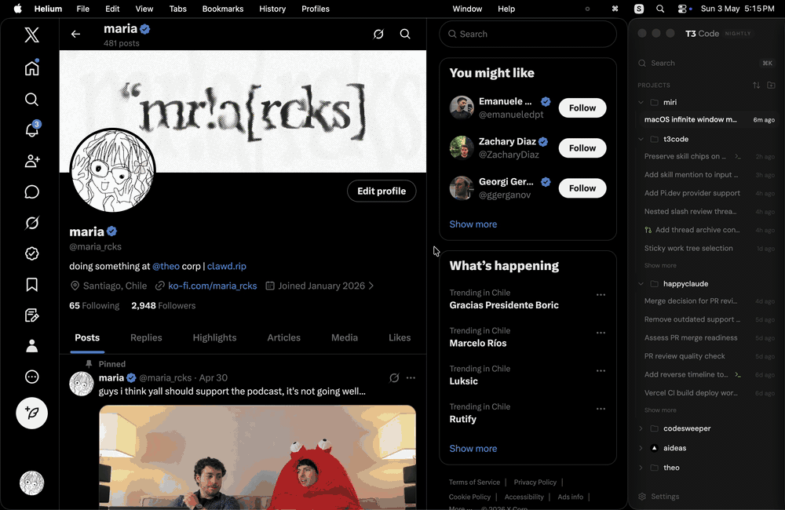

<div align="center">

# scrollini

[](./LICENSE)
[](https://github.com/krishkalaria12/scrollini)
[](https://ko-fi.com/krishkalaria12)



_Niri-ish, keyboard-first window manager for macOS._

</div>

## Install

Build and run from source:

```bash
git clone https://github.com/krishkalaria12/scrollini.git
cd scrollini/apps/macos
swift run Scrollini
```

For a release build:

```bash
swift build -c release
.build/release/Scrollini
```

To build a local macOS disk image:

```bash
scripts/package-macos.sh --version 0.1.0
open dist/Scrollini-0.1.0-*.dmg
```

scrollini needs Accessibility permission, and the event tap may also need Input
Monitoring permission. If you run it from a terminal, macOS may ask for the
terminal app itself to get those permissions.

## What it does

- Keeps a Niri-like virtual layout of workspaces and columns on macOS.
- Tiles normal app windows with Accessibility APIs instead of acting as a
  compositor.
- Makes each column `0.8` screen widths by default, so the next column can peek
  in while you move sideways.
- Sizes columns with Niri's proportional formula, so `inner_gap` is reserved
  space rather than a cosmetic inset and two `0.5` columns tile the screen
  exactly, gaps included.
- Packs the strip against the width each window actually accepted. Apps with
  minimum sizes or character-cell width increments cannot always take the width
  they are asked for, and packing against the requested width would leave a band
  of empty desktop beside every one of them.
- Centers the focused column when possible, while keeping the first column
  pinned to the left edge.
- Tracks `Cmd+Tab`, app launches, app exits, manual window resizes, and focused
  windows so the model follows macOS instead of fighting it.
- Supports app rules for tiled, floating, and ignored windows.
- Adds a graphical menu bar status item with workspace/window status, settings
  shortcuts, layout reapply, a keybinding pause toggle, and safe quit.
- Hot-reloads config changes without restarting, keeping the previous config if
  a saved file cannot be parsed.
- Persists workspace, column order, manual widths, and focused window across
  restarts.
- Parks off-workspace windows near the side edge, with optional SkyLight alpha
  hiding when those private symbols are available.
- Restores tiled windows on normal exit and starts a small cleanup watcher for
  crash or kill recovery.

## Shortcuts

| Shortcut | Action |
| :------- | :----- |
| `Ctrl+Opt+Left` / `Ctrl+Opt+Right` | Focus column left / right |
| `Ctrl+Opt+Up` / `Ctrl+Opt+Down` | Focus workspace up / down |
| `Ctrl+Opt+[` / `Ctrl+Opt+]` | Focus first / last column |
| `Ctrl+Opt+1`..`Ctrl+Opt+9` | Focus workspace by dynamic index |
| `Ctrl+Opt+0` | Focus the previous workspace |
| `Ctrl+Opt+Shift+Left` / `Ctrl+Opt+Shift+Right` | Move column left / right |
| `Ctrl+Opt+Shift+Up` / `Ctrl+Opt+Shift+Down` | Move column to workspace up / down |
| `Ctrl+Opt+Shift+[` / `Ctrl+Opt+Shift+]` | Move column to first / last |
| `Ctrl+Opt+Shift+1`..`Ctrl+Opt+Shift+9` | Move column to workspace by index |
| `Ctrl+Opt+R` | Cycle the active column through the width presets |
| `Ctrl+Opt+-` / `Ctrl+Opt+=` | Nudge the active column narrower / wider |
| `Ctrl+Opt+F` | Maximize the active column, or restore its previous width |
| `Ctrl+Opt+Shift+R` | Reset the active column to its configured width |
| four-finger swipe up / down | Switch workspace |

`Ctrl+Opt` focuses. `Ctrl+Opt+Shift` moves whatever `Ctrl+Opt` focuses. One modifier
pair covers everything because `Ctrl+Opt` is the only two-modifier combination macOS
leaves unclaimed, so no default here fights Hide Application, Enter Full Screen,
browser tab switching, the screenshot shortcuts, or the Option character layer.
`excluded_keybindings` ships empty for that reason. Everything else passes through.

Opt is the key labelled `option` and `alt`, marked ⌥, between Control and Command.

Five commands ship unbound and are yours to assign: `cycle_width_preset_backward`,
`cycle_all_width_presets_forward`, `cycle_all_width_presets_backward`,
`nudge_all_widths_narrower`, and `nudge_all_widths_wider`. Cycling forward wraps at
both ends, so the backward binding is a convenience rather than a necessity.

Trackpad navigation uses Apple's private MultitouchSupport framework so Scrollini can
see raw contact movement without stealing normal two-finger scrolling. Four fingers
move between virtual workspaces, and nothing else is claimed: columns move by
keybinding, so two- and three-finger scrolling still belongs to the app under the
cursor. The swipe moves a continuous camera with momentum, then focuses the
workspace nearest the camera when the motion settles.

Scrollini waits until the fingers have travelled
`trackpad_navigation_direction_lock_threshold` of the trackpad before moving, which
keeps a resting hand from nudging the camera. Only vertical travel counts after
that, so a swipe that wanders sideways still lands on a workspace. The 6.4
workspaces per swipe default is Niri's ratio, one workspace per quarter of the
travel Niri needs to scroll a screen width.

## Config

scrollini loads the first config file it can read:

- `SCROLLINI_CONFIG`
- `./scrollini.config.json`
- `$XDG_CONFIG_HOME/scrollini/config.json`
- `~/.config/scrollini/config.json`

`$XDG_CONFIG_HOME/scrollini/config.json` is checked only when `XDG_CONFIG_HOME` is
set. If it is unset, scrollini falls back to `~/.config/scrollini/config.json`.

The loaded config file is watched for changes. Saving valid JSON reloads
keybindings, rules, layout settings, animations, and trackpad settings in place.
If a save cannot be parsed, scrollini keeps running with the previous config.
The menu bar item can open or reveal the loaded settings file, reveal the saved
layout state file, reload settings, reapply the layout, pause and resume
keybindings, and quit while restoring tiled windows.

Every key is optional, so a config file only has to list what it changes. An
omitted key keeps its built-in default, which means `{}` is a valid config and

```json
{ "inner_gap": 20 }
```

is a complete one. `rules` works the same way, with one wrinkle: leaving it out
inherits the built-in rules, while an explicit `"rules": []` clears them.

The repo includes a full default config. A compact version looks like this:

```json
{
  "default_width_ratio": 0.8,
  "preset_width_ratios": [0.5, 0.67, 0.8, 1.0],
  "animation_duration_ms": 240,
  "keyboard_animation_ms": 240,
  "hover_focus_animation_ms": 240,
  "trackpad_settle_animation_ms": 240,
  "move_column_animation_ms": 240,
  "width_animation_ms": 280,
  "animation_curve": "smooth",
  "hover_to_focus": true,
  "hover_focus_delay_ms": 120,
  "hover_focus_max_scroll_ratio": 0.15,
  "hover_focus_requires_visible_ratio": 0.15,
  "hover_focus_edge_trigger_width": 8,
  "hover_focus_after_trackpad_ms": 280,
  "hover_focus_mode": "edge_or_visible",
  "workspace_auto_back_and_forth": true,
  "center_focused_column": true,
  "focus_alignment": "smart",
  "new_window_position": "after_active",
  "inner_gap": 12,
  "outer_gap": 12,
  "parked_sliver_width": 1,
  "excluded_keybindings": [],
  "keybindings": {
    "column_left": ["ctrl+alt+left", "ctrl+alt+h"],
    "column_right": ["ctrl+alt+right", "ctrl+alt+l"],
    "workspace_down": ["ctrl+alt+down", "ctrl+alt+j"],
    "workspace_up": ["ctrl+alt+up", "ctrl+alt+k"],
    "cycle_width_preset_backward": ["ctrl+alt+shift+f"]
  },
  "trackpad_navigation": true,
  "trackpad_navigation_workspace_fingers": 4,
  "trackpad_navigation_workspace_sensitivity": 6.4,
  "trackpad_navigation_direction_lock_threshold": 0.02,
  "trackpad_navigation_deceleration": 5.5,
  "trackpad_navigation_hover_suppression_ms": 280,
  "trackpad_navigation_momentum_min_velocity": 80,
  "trackpad_navigation_velocity_gain": 1.35,
  "trackpad_navigation_settle_animation_ms": 240,
  "trackpad_navigation_invert_y": false,
  "rescan_interval_ms": 1000,
  "restore_on_exit": true,
  "persist_layout": true,
  "state_path": null,
  "hide_method": "skylight_alpha",
  "debug_logging": false,
  "rules": [
    {
      "bundle_id": "com.apple.finder",
      "behavior": "float"
    }
  ]
}
```

`keybindings` is merged with the built-in defaults by action name, so a config
can override only the actions it cares about. Each action takes a list, so the
sample above puts column navigation on the arrow keys and on `hjkl` at the same
time. Set an action to `[]` to disable it.

`excluded_keybindings` always wins over `keybindings` and is the escape hatch for
rebinding into territory macOS or an app already owns. Nothing in the defaults needs
it, but if you move a binding onto, say, `cmd+shift+4`, add the chord there to hand
it back to the system.

A top-level `excluded_keybindings` gives a chord up everywhere. To give one up in a
single app, put `excluded_keybindings` on a rule instead:

```json
"rules": [
  { "bundle_id": "com.apple.Safari", "excluded_keybindings": ["ctrl+alt+left", "ctrl+alt+right"] }
]
```

Those chords now reach Safari and keep working everywhere else. Rule exclusions are
checked against the frontmost application on every keystroke, so the rule needs a
`bundle_id` or an `app_name`; a rule with only `title_contains` is ignored for this
and logs a warning. Every matching rule contributes, so ordering does not matter.

When a shortcut is fighting an app and you want it back right now, the menu bar has
**Pause Keybindings**. Pausing stops scrollini claiming keystrokes and nothing else:
the strip keeps its layout, four-finger swipes keep switching workspace, and
windows stay where they are.

See `scrollini.config.json` for the full command-name list.

Keybinding strings support the standard modifiers `cmd`/`win`/`windows`/`super`/`meta`,
`ctrl`, `shift`, `alt`/`option`, and `fn`/`globe`, so a chord like `ctrl+alt+fn+left`
is expressible on a MacBook keyboard that has no Home or End key.

Be careful binding `home`, `end`, `pageup`, or `pagedown` on a laptop. Because fn+Left
is how a MacBook types Home, scrollini also matches those chords with the `fn` stripped,
which means binding `cmd+home` would swallow Cmd+fn+Left and take jump-to-start-of-document
away from every text field. The defaults use `[` and `]` instead.

Useful string settings:

- `animation_curve`: `smooth`, `snappy`, or `linear`
- `hover_focus_mode`: `off`, `visible_only`, or `edge_or_visible`
- `focus_alignment`: `left`, `center`, or `smart`
- `new_window_position` and rule `open_position`: `before_active`,
  `after_active`, or `end`
- `hide_method`: `skylight_alpha` or `park_only`

Useful trackpad numbers:

- `trackpad_navigation_workspace_fingers`: contact count for workspace
  navigation. Defaults to `4`.
- `trackpad_navigation_workspace_sensitivity`: workspaces per full swipe up or
  down the trackpad, 6.4 by default
- `trackpad_navigation_direction_lock_threshold`: fraction of the trackpad a
  swipe must cross before the camera moves at all. Raise it if a resting hand
  moves workspaces, lower it if swipes feel slow to catch on

Rules can match on `bundle_id`, `app_name`, or `title_contains`. Use
`behavior: "ignore"` for windows scrollini should leave alone, `behavior: "float"`
for visible untiled windows that should be raised above tiled columns, and
`width_ratio` to override an app's default column width. Rules can also set `workspace`, `open_position`,
`trackpad_navigation`, `hover_to_focus`, and `excluded_keybindings` for matching windows.

With `persist_layout` enabled, scrollini writes a local layout snapshot to
`$XDG_STATE_HOME/scrollini/layout.json` or `~/.local/state/scrollini/layout.json`. Set
`state_path` to override that location. The snapshot uses app names, bundle IDs,
and window titles to match windows after restart.

## Development

```bash
swift build
swift run Scrollini
```

Run the invariant checks before sending a change:

```bash
swift build
"$(swift build --show-bin-path)/Scrollini" --self-check
```

These cover the parts of scrollini that are pure computation: strip geometry,
layout projection, rule resolution, keybinding parsing, config clamping, and
workspace bookkeeping. They exit non-zero on failure and the release workflow
gates on them. They run as a subcommand rather than under `swift test` because
`swift test` needs XCTest or swift-testing, and neither ships with the Command
Line Tools that build the rest of this project.

## Releases

Release artifacts are built by `.github/workflows/release.yml`.

- Push a stable tag like `v0.1.0` to publish a GitHub Release.
- Run the workflow manually with `channel: nightly` to publish a prerelease.
- The scheduled nightly checks whether `main` changed since the last nightly tag
  before publishing.
- The macOS artifact is a `Scrollini-<version>-arm64-darwin.dmg` containing
  `Scrollini.app`.

## Notes

- scrollini targets macOS 13+ and Swift 6.
- It uses public Accessibility APIs for the core window control path.
- It manages one display: the primary screen, the one your menu bar is on.
  Windows on other displays are left alone. The choice is deliberate rather than
  ambient, so moving a window or opening the settings panel on a second display
  does not drag the layout across with it.
- Every accessibility call is capped at 250 ms. Those calls are synchronous and
  share a thread with the event tap that carries your keystrokes, so an
  unbounded one would let a beachballing app take your keyboard with it.
- The SkyLight path is private and optional; if it is unavailable, hidden
  windows stay parked as side-edge slivers.
- This does not use native macOS Spaces.

## Links

- Repository: https://github.com/krishkalaria12/scrollini
- Research notes: [docs/macos-window-management-investigation.md](docs/macos-window-management-investigation.md)
- Niri behavior notes: [docs/niri-mvp-behavior-notes.md](docs/niri-mvp-behavior-notes.md)
